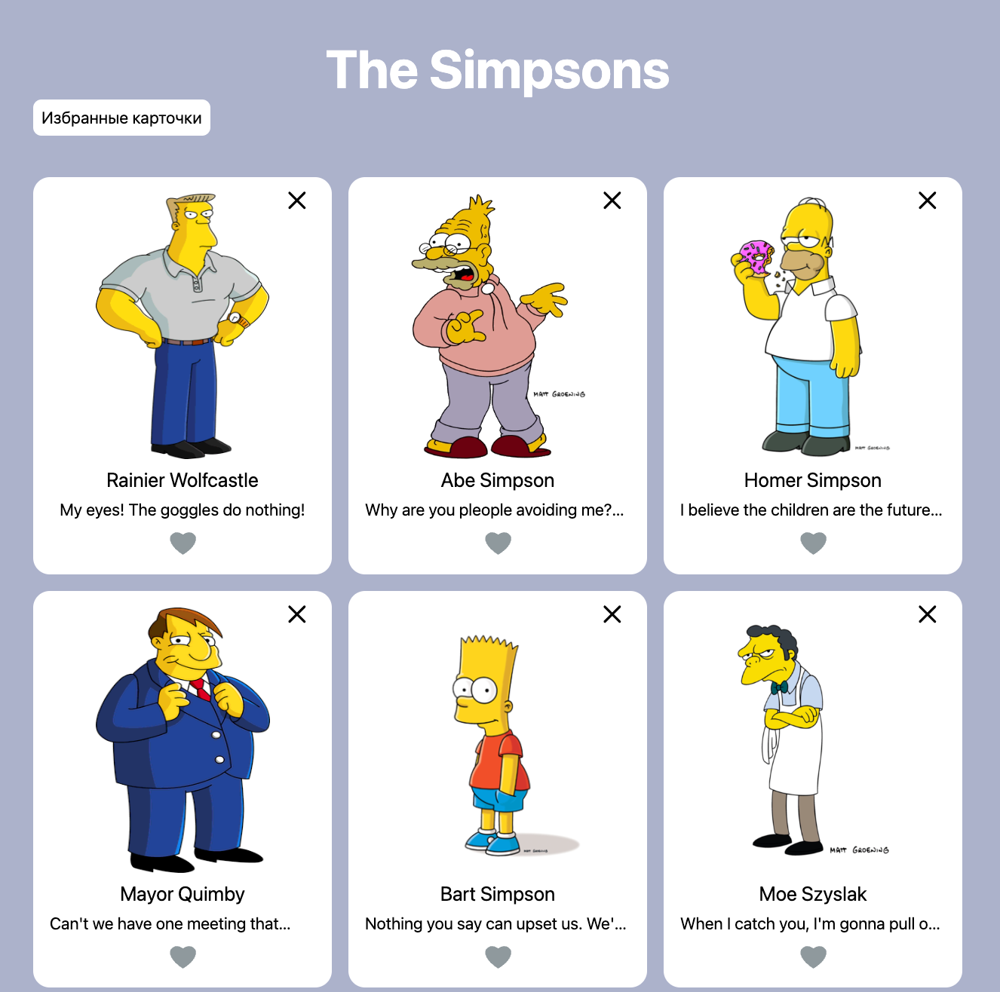

# Тестовое задание 

Задание: Создать SPA со списком карточек, на каждой из которых выводится картинка и любая информация

### Деплой проекта: https://lkhusnullina.github.io/test_sar/



### Технологии: 
React redux typescript

#### Запуск проекта

#### Скачайте архив проекта или склонируйте репозиторий

```sh
git@github.com:lkhusnullina/test_sar.git
```

#### Установите зависимости проекта

```sh
npm install
```
#### Запустите проект командой

```sh
npm run start
```